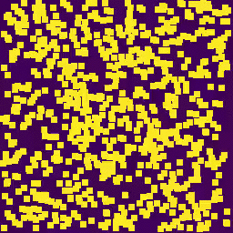
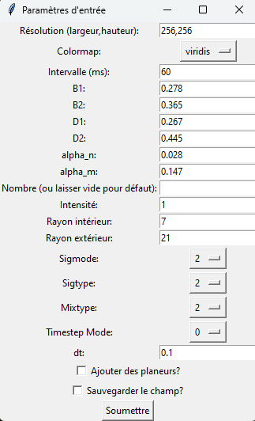
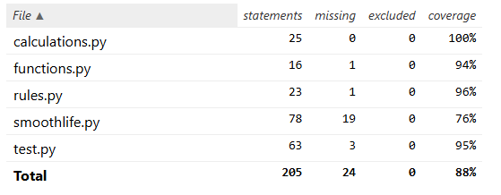

Voici ton README mis en forme avec une structure Markdown claire et organisée :

---

# SmoothLifePlus

**SmoothLife**, créé par **Stephan Rafler**, est une variante du célèbre **Jeu de la Vie** de John Conway, qui repose sur des règles mathématiques avancées pour modéliser des systèmes dynamiques complexes. Contrairement au jeu original basé sur une grille discrète, SmoothLife introduit une continuité grâce à des valeurs flottantes et des transitions douces.



---

## 📜 **Principes fondamentaux**

### 🔹 **Différences avec le Jeu de la Vie classique :**
- **Transitions continues :** Utilisation de valeurs flottantes et de fonctions sigmoïdes pour des transitions fluides.
- **Voisinage isotrope :** Sélection des voisins basée sur un cercle plutôt qu’une grille carrée.
  
### ⚙️ **Avantages de l'approche circulaire :**
- **Isotropie :** Effets directionnels éliminés, structures plus naturelles.
- **Règles dynamiques :** Moyenne pondérée sur une région pour des changements d'état plus réalistes.
- **Modélisation réaliste :** Influence progressive des voisins, imitant des systèmes biologiques ou physiques.

---

## 🚀 **Statut du projet**

- **Statut :** Pleinement fonctionnel  
- **Version actuelle :** v1.0  

---

## 🛠️ **Fonctionnalités**

- Animation fluide en continu sur les plans temporel et spatial.
- Personnalisation de **20 paramètres** via une interface graphique.
- Ajout aléatoire ou structuré de configurations initiales (planeurs, tâches).
- Visualisation avec différentes palettes de couleurs (**viridis**, **plasma**, etc.).
- Sauvegarde des états initiaux en **JSON**.
- Simulation optimisée par transformée de **Fourier**.

---

## 💻 **Installation : Les prérequis**

- **Python 3.8** ou supérieur.
- **Modules requis :** `matplotlib`, `numpy`, `math`.

### Installation des dépendances :
```bash
pip install -r requirements.txt
```

---

## ▶️ **Utilisation**

Exécutez le fichier principal :
```bash
python smoothlife.py
```


---

## 🎮 **Exemples de simulations**

### 🔸 **Simulation standard :**
```bash
python smoothlife.py
```
- **Paramètres :**  
  `resolution = "256,256"`, `cmap = "viridis"`, `speed = 60`, ...  

### 🔸 **Simulation avec planeurs :**
- **Paramètres :**  
  `glider = coché`  

### 🔸 **Simulation artistique :**
- **Paramètres :**  
  `resolution = "512,512"`, `cmap = "plasma"`, `speed = 30`, ...  

---

## 📊 **Test Coverage**

- **Coverage du code :** 88%  
- **Génération du rapport :**
  ```bash
  python -m pytest --cov=. --cov-report html test.py
  ```


---

## 🌍 **Applications concrètes**

SmoothLifePlus peut être appliqué dans des domaines comme :
- **Biologie computationnelle**
- **Automates cellulaires continus**
- **Morphogenèse**
- **Animations artistiques et visuelles**

---

## 👥 **Crédits / Auteurs**

- **Développé par :**  
  Josselin Perret, Oscar Eav, Antonioli Enzo, Arthur De Bom Van Driessche, Solène Zhang.
- **Sources d'inspiration :**  
  - **S. Rafler** pour la théorie SmoothLife.
  - **John Conway** pour le Jeu de la Vie.
  - Article recommandé : [Conway’s Game of Life for Curved Surfaces](https://0fps.net/2012/11/19/conways-game-of-life-for-curved-surfaces-part-1/)

---

Cette nouvelle mise en forme organise les sections de manière claire, utilise des icônes pour structurer l'information et améliore la lisibilité globale. Qu'en penses-tu ? 😊
