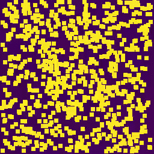
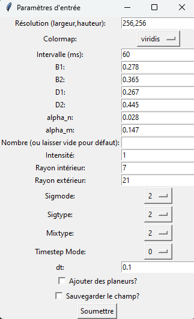
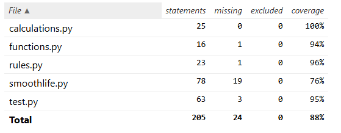

# SmoothLifePlus

SmoothLifePlus is a Python implementation and visualizer of SmoothLife, a continuous-state cellular automaton proposed by Stephan Rafler. It is inspired by Conway's Game of Life but operates on a continuous field (values in the range [0, 1]) with smooth transitions rather than binary cell states.



## What this repository contains

- `smoothlife.py`: simulation loop and Matplotlib animation entry point.
- `rules.py`: SmoothLife transition rules (basic and extended variants).
- `calculations.py`: precomputed isotropic neighborhood masks and FFT helpers.
- `parameters.py`: parameter input dialog (Tkinter GUI).
- `field.json`, `glider_field.json`: example initial conditions (saved as JSON arrays).
- `test.py`: unit tests (unittest-based).

## Model overview (implementation notes)

This implementation follows the standard SmoothLife structure:

1. Represent the world as a 2D array of floats in [0, 1].
2. Compute two neighborhood averages each step:
   - an "inner" disk average and an "outer" ring (annulus) average.
3. Apply smooth birth/survival thresholds using sigmoid-like functions to produce the next field values.

For performance, neighborhood sums are computed using convolution in the frequency domain (FFT). The masks are precomputed once (see `calculations.py`) and applied each step via elementwise multiplication in Fourier space, followed by an inverse FFT back to the spatial domain (see `SmoothLife.step()` in `smoothlife.py`).

## Requirements

- Python 3.8+ (tested with Python 3.12).
- Python packages required to run:
  - `numpy`
  - `matplotlib`
- GUI dependency:
  - `tkinter` (part of the standard library on many platforms, but may require an extra OS package on some Linux distributions such as `python3-tk`)

Notes on `requirements.txt`:

- The repository includes a pinned `requirements.txt` that contains additional packages beyond the core runtime dependencies (for example: `pytest`, `coverage`).
- It also includes `pywin32`, which is Windows-specific and will not install on Linux/macOS without platform markers.

## Installation

Create a virtual environment and install the core dependencies:

```bash
python -m venv .venv
source .venv/bin/activate
python -m pip install --upgrade pip
python -m pip install numpy matplotlib
```

If you are on Windows (PowerShell):

```powershell
python -m venv .venv
.\.venv\Scripts\Activate.ps1
python -m pip install --upgrade pip
python -m pip install numpy matplotlib
```

## Usage

Run the main script:

```bash
python smoothlife.py
```

- A Tkinter dialog is used to input parameters.
- A Matplotlib window then displays the evolving field.



## Initial conditions and output files

- Random initialization: `SmoothLife.add_speckles()` fills the field with random patches.
- Glider initialization: enabling the `glider` option loads `glider_field.json`.
- Saving an initial field: enabling the `save` option writes the generated field to `field.json`.

## Testing

Unit tests are in `test.py` and use the standard library `unittest` module.

```bash
MPLBACKEND=Agg python -m unittest -v
```

If you want a coverage report, install `pytest` and `pytest-cov` and run:

```bash
python -m pip install pytest pytest-cov
python -m pytest --cov=. --cov-report=html test.py
```

Example coverage output:



## References

- Stephan Rafler, "SmoothLife - A continuum version of Conway's Game of Life" (2011). Commonly distributed as a PDF online (often referenced via `smoothlife.net`).
- Martin Gardner, "Mathematical Games: The fantastic combinations of John Conway's new solitaire game 'life'", Scientific American (October 1970).
- Conway's Game of Life overview: https://en.wikipedia.org/wiki/Conway%27s_Game_of_Life
- "Conway's Game of Life for Curved Surfaces" (0fps). https://0fps.net/2012/11/19/conways-game-of-life-for-curved-surfaces-part-1/
- NumPy FFT documentation (used for frequency-domain convolution in this implementation). https://numpy.org/doc/stable/reference/routines.fft.html

## License

No license file is present in this repository. If you intend to reuse or redistribute this code, clarify licensing with the repository owners first.

## Authors

Josselin Perret, Oscar Eav, Antonioli Enzo, Arthur De Bom Van Driessche, Solène Zhang.
